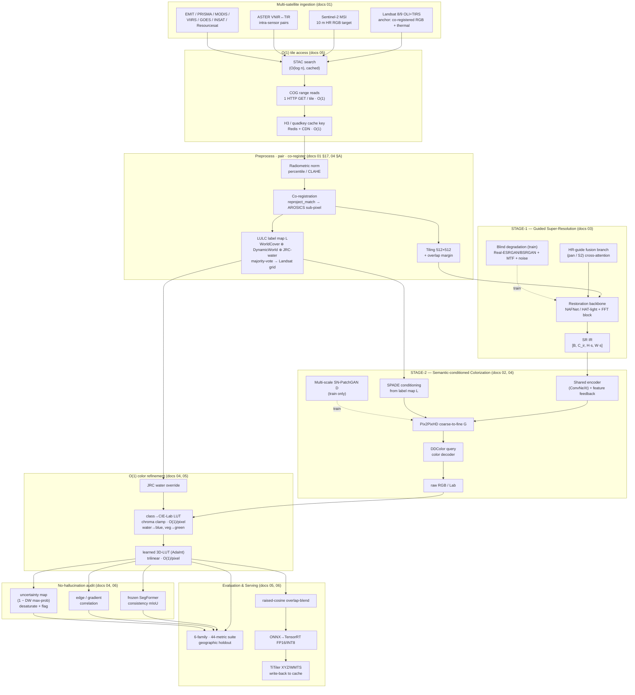
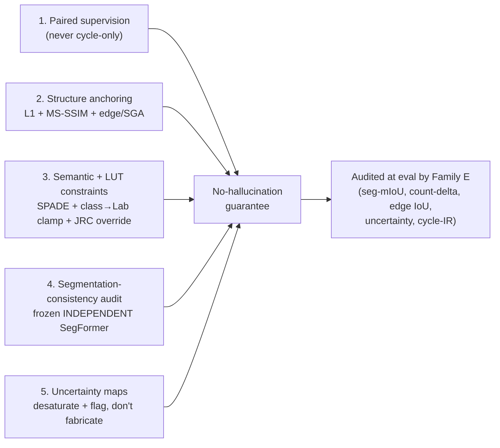

# irchroma — System Architecture

**Bharatiya Antariksh Hackathon 2026 · Problem Statement 10**
*Infrared image colorization and enhancement for improved object interpretation.*

> An end-to-end, Python framework that **super-resolves / sharpens** monochrome infrared (IR) satellite imagery **and** colorizes it **IR → RGB** realistically — preserving semantic integrity (**no hallucinations**), boosting downstream detection/segmentation, evaluated on **PSNR / SSIM / FID + per-tile latency**.

This document is the **authoritative design contract**. The package skeleton in `src/irchroma/`, the configuration contract in [`src/irchroma/config.py`](src/irchroma/config.py), and the code contract in [`src/irchroma/interfaces.py`](src/irchroma/interfaces.py) implement what is specified here. Every parallel builder conforms to §13 (repository layout) and §14 (module contracts).

Every major decision is grounded in the six deep-research reports under [`docs/research/`](docs/research/):

| Doc | Topic | Drives |
|---|---|---|
| [`01-datasets.md`](docs/research/01-datasets.md) | 31 multi-satellite sources, GEE/STAC IDs, pairing recipes | §4 Data layer |
| [`02-colorization-models.md`](docs/research/02-colorization-models.md) | 24 colorization methods; paired Pix2PixHD+DDColor primary, BBDM backup | §6 Colorization, §8 Loss |
| [`03-super-resolution.md`](docs/research/03-super-resolution.md) | 29 SR methods; guided cross-sensor SR primary | §5 Super-resolution, §8 Loss |
| [`04-semantic-guidance.md`](docs/research/04-semantic-guidance.md) | LULC data, SPADE, O(1) color-LUT, segmentation-consistency | §7 Semantic, §11 Anti-hallucination |
| [`05-fast-platform-o1.md`](docs/research/05-fast-platform-o1.md) | 38 O(1)/fast techniques | §9 Fast platform |
| [`06-evaluation-metrics.md`](docs/research/06-evaluation-metrics.md) | 44 metrics, geographic-holdout protocol, goalposts | §10 Evaluation |

---

## Table of contents

1. [Executive summary & problem framing](#1-executive-summary--problem-framing)
2. [Design principles](#2-design-principles)
3. [System overview & dataflow](#3-system-overview--dataflow)
4. [Data layer](#4-data-layer)
5. [Stage-1 — Enhancement (Super-Resolution)](#5-stage-1--enhancement-super-resolution)
6. [Stage-2 — Colorization (IR→RGB)](#6-stage-2--colorization-irrgb)
7. [Semantic integrity & color consistency](#7-semantic-integrity--color-consistency)
8. [Loss design](#8-loss-design)
9. [Fast-platform & O(1) inference](#9-fast-platform--o1-inference)
10. [Evaluation & validation](#10-evaluation--validation)
11. [Anti-hallucination guarantees (consolidated)](#11-anti-hallucination-guarantees-consolidated)
12. [Tech stack & dependencies](#12-tech-stack--dependencies)
13. [Repository layout](#13-repository-layout)
14. [Module contracts](#14-module-contracts)
15. [Phased roadmap & metric mapping](#15-phased-roadmap--metric-mapping)
16. [References](#16-references)

---

## 1. Executive summary & problem framing

### 1.1 The problem

Satellite IR sensors image through night and adverse weather, but their output is **monochrome, low-contrast, and texture-poor**. Analysts and CV models struggle to read vehicles, buildings, roads, and vegetation off raw thermal. PS-10 asks for an **end-to-end framework** that simultaneously:

1. **Enhances structure** — super-resolve / sharpen faint IR edges and textures.
2. **Colorizes IR → RGB** — map monochrome IR to *realistic* color (forest→green, water→blue) **without introducing artifacts**.
3. **Preserves semantic integrity** — never distort or misrepresent real ground-truth objects.
4. **Boosts downstream tasks** — measurably improve object detection and segmentation.

Graded on **PSNR, SSIM, FID, per-tile inference time**, and a **qualitative no-hallucination check**.

### 1.2 Why this is hard — three coupled sub-problems

This is **not** classic colorization. In ordinary photo colorization the input luminance *is already the correct RGB luminance*; the model only invents chrominance. Here the input is **thermal/IR radiance, which is not RGB luminance** — a hot road and a cool road look identical in RGB; NIR-bright vegetation is mid-tone green in RGB. So the task is genuinely **cross-modal image-to-image translation** (closer to SAR→optical than to old-photo colorization). Three sub-problems are coupled:

| Sub-problem | Core tension | Our resolution |
|---|---|---|
| **Super-resolution** | Coarse thermal (Landsat TIRS native 100 m) holds little real high-frequency → pure SISR *must hallucinate*. | **Guided** cross-sensor SR: a real co-registered HR band supplies genuine structure (§5). |
| **IR→RGB colorization** | Mapping is **one-to-many**; L2 → desaturated sepia mean, GAN/diffusion → vivid but **invented** detail. | Paired conditional GAN, **fidelity-dominant** loss, bounded generative terms (§6, §8). |
| **Semantic faithfulness** | "Plausible" color can silently **mislabel land cover** — the most dangerous hallucination. | Land-cover **SPADE** conditioning + O(1) class→color **LUT** + frozen-segmenter **consistency loss** (§7, §11). |

### 1.3 The chosen system in one paragraph

A **two-stage, modular pipeline with a shared restoration backbone**. **Stage-1** performs *guided cross-sensor super-resolution* (NAFNet/HAT-light restoration backbone + an HR-guide fusion branch, trained under realistic blind degradation). **Stage-2** performs *semantically-conditioned colorization* (Pix2PixHD coarse-to-fine generator + SPADE land-cover conditioning + a DDColor-style query color decoder, against a multi-scale spectral-norm PatchGAN). A precomputed **O(1) class→CIE-Lab color-LUT** clamps chroma toward physically plausible per-class color, an optional **learned 3D-LUT (AdaInt)** refines color at near-zero cost, and a **frozen independent SegFormer** audits semantic consistency. Inference runs **patch-tiled with raised-cosine overlap-blend**, exported to **ONNX→TensorRT FP16/INT8**, with **H3/quadkey-keyed caching** and **COG range reads** over a TiTiler serving layer. Validation uses a **6-family, 44-metric** suite under a **geographic-holdout** protocol with **Blau–Michaeli distortion–perception–semantic triangulation**.

A **BBDM (Brownian-Bridge Diffusion)** model with ControlNet edge+semantic conditioning is kept as a **quality-ceiling backup** for maximum FID when latency permits.

---

## 2. Design principles

These five principles govern every trade-off in the system. They map directly to PS-10's grading axes.

### P1 — Fidelity-dominant (anti-hallucination by construction)
Fidelity/structure losses **dominate** the objective; generative (adversarial/colorfulness/histogram) terms are deliberately **bounded** (§8). The model is *pixel-anchored* to ground truth via heavy L1/Charbonnier + MS-SSIM + edge/gradient + feature-matching, so it cannot relocate a road or grow a building without paying a large penalty. *Realism never overrides ground truth.* (docs/research/02 §7, 03 §9.)

### P2 — No-hallucination is engineered, not hoped for
Five independent, layered guarantees (§11): **(a)** paired supervision (never cycle-only); **(b)** structure anchoring (L1+SSIM+edge); **(c)** semantic SPADE conditioning + O(1) color-LUT class constraints; **(d)** a frozen *independent* segmentation-consistency audit; **(e)** uncertainty maps that desaturate + flag low-confidence pixels instead of fabricating confident color.

### P3 — Multi-source data fusion with cross-verification
Landsat 8/9 is the anchor (the only single platform with co-registered RGB **and** thermal), but a robust model needs *many* IR↔RGB pairings to fuse and cross-verify against: ASTER (intra-sensor), Sentinel-2 (HR target), EMIT/PRISMA (spectrally exact self-pairs), MODIS/VIIRS/GOES (volume + night), and ISRO INSAT/Resourcesat (Indian domain). Multiple datasets fill gaps and validate each other (§4). (docs/research/01.)

### P4 — O(1) fast-platform on the hot path
The per-request hot path (one tile, one zoom) is dominated by genuinely **O(1)** primitives — cache lookup, COG range read, fixed-size tile inference, LUT color — while inherently O(log n)/O(n) work (catalog search, mosaicking, pyramid build) is done rarely and/or precomputed, then cached behind an O(1) key. We are **honest about complexity**: "O(1) *per tile*", not "O(1) over the global archive" (§9). (docs/research/05.)

### P5 — Two-stage modular (debuggable, swappable, separately budgetable)
SR and colorization are **decoupled stages sharing an initialized encoder** (+ light feature feedback), *not* one monolithic network. This separates the PSNR/SSIM (SR) audit from the FID (color) audit, lets either module be swapped/retrained independently, makes the no-hallucination audit tractable (you can tell whether a fake edge came from SR vs color), and lets each stage carry its own latency budget. (docs/research/03 §10.)

---

## 3. System overview & dataflow

The full pipeline: **multi-satellite ingestion → O(1) tile access → preprocessing / pairing / co-registration → Stage-1 guided SR → Stage-2 semantic-conditioned colorization → O(1) 3D-LUT color refinement → no-hallucination audit → evaluation / serving.**



**Reading the diagram.** Solid arrows are the runtime path; dashed arrows (`-.train.->`) are training-only (degradation synthesis, discriminator). The label map `L` is computed once per tile during preprocessing and feeds three places: SPADE conditioning, the class→color LUT clamp, and the consistency audit. The hot serving path (cache → COG read → tiled inference → LUT → blend → serve) is all O(1)-per-tile (§9).

### 3.1 End-to-end tensor flow (the contract in motion)

| Step | Operation | Tensor in → out |
|---|---|---|
| Ingest | COG windowed read | bytes → `ir [B,C_ir,H,W]`, `guide [B,C_g,Hg,Wg]`, `rgb? [B,3,Hs,Ws]` |
| Label | LULC majority-vote → Landsat grid | rasters → `semantic [B,H,W]` (LongTensor) |
| Stage-1 | guided SR | `ir (+guide)` → `sr [B,C_ir,Hs,Ws]`, `Hs=H·scale` |
| Stage-2 | colorize | `sr (+semantic, +guide)` → `rgb_raw [B,3,Hs,Ws]` |
| Refine | class-LUT clamp + 3D-LUT | `rgb_raw (+semantic)` → `rgb [B,3,Hs,Ws] ∈ [0,1]` |
| Audit | frozen checker + uncertainty | `rgb` → `semantic_pred`, `uncertainty [B,1,Hs,Ws]` |

This is exactly the `Sample → PipelineOutput` contract in [`interfaces.py`](src/irchroma/interfaces.py) (§14).

---

## 4. Data layer

> Implements: [`src/irchroma/data/`](src/irchroma/data/). Config: `DataConfig`. Source: docs/research/01 (+ 04 §A for labels).

### 4.1 The multi-satellite stack (ranked)

PS-10 *names Landsat 8/9*, but a robust IR→RGB model needs **many** IR↔RGB pairings to fuse and cross-verify. We rank sources by fit to *(IR→RGB colorization + SR + Indian-domain + fast access)*:

| Rank | Source | GEE / STAC ID | Role | Pairing | Co-reg cost |
|---|---|---|---|---|---|
| **1** | **Landsat 8/9 OLI+TIRS** (C2 L2) | `LANDSAT/LC0{8,9}/C02/T1_L2` | **Anchor.** IR `ST_B10` → RGB `SR_B4/3/2`; PS-required | intra-platform | **none** (pre-aligned) |
| **2** | **ASTER** | `ASTER/AST_L1T_003` | High-res intra-sensor VNIR(15 m)↔TIR(90 m) | intra-platform | minimal (built-in) |
| **3** | **Sentinel-2 MSI** | `COPERNICUS/S2_SR_HARMONIZED` | **10 m RGB SR target**; cross-pair w/ Landsat thermal | cross-sensor target | reproject + AROSICS |
| **4** | **WorldStrat** (S2↔SPOT 1.5 m) | Zenodo `6810792` | SR head training (LR→HR RGB) | curated cross-sensor | pre-aligned |
| **5** | **EMIT + PRISMA** (hyperspectral) | LP DAAC `EMITL2ARFL`; ASI | **Spectrally-exact self-pairs** (anti-hallucination) | intra-sensor (synth bands) | none (same cube) |
| **6** | **Sentinel-3 SLSTR/OLCI, MODIS, VIIRS DNB** | `COPERNICUS/S3/OLCI`, `MODIS/061/MOD09GA`, `NOAA/VIIRS/...DNB...` | Coarse high-volume vis↔thermal + **night DNB** | intra-platform | none |
| **7** | **GOES-R ABI / Himawari AHI** | `NOAA/GOES/{16,18}/MCMIPF` | Diurnal vis↔IR (day RGB + night IR, same scene) | intra-platform | none |
| **8** | **INSAT-3D/3DR (MOSDAC)** + **Resourcesat LISS-IV (Bhuvan)** | MOSDAC / Bhuvan | **Indian-domain** vis↔thermal + 5.8 m RGB target | mixed | mixed |
| **9** | **LLVIP / KAIST / M3FD** | GitHub / KAIST RCV | Ground-truth visible↔IR + downstream-detection metric | curated, registered | pre-aligned |
| **10** | **Sentinel-1 SAR + SEN12MS/BigEarthNet** | `COPERNICUS/S1_GRD` | All-weather/night fusion branch; LULC labels | cross-modal | terrain-corrected |

**Why Landsat is the backbone.** OLI (RGB) and TIRS (thermal) are co-registered on the *same satellite* in C2 L1T/L2 products — `SR_B4/B3/B2` and `ST_B10` are **already pixel-aligned in one asset, no extra registration needed**. This is the single biggest reason it anchors the system. (docs/research/01 §1.)

**Minimum viable hackathon stack:** #1 Landsat + #3 Sentinel-2 (headline SR+colorization via GEE) + #2 ASTER (extra intra-sensor pairs) + #9 LLVIP (validate translation + report detection metric) + #8 one Indian source (domain relevance).

**Key Landsat bands** (C2 L2, scale before use: SR `DN·2.75e-5 − 0.2`; ST `DN·3.41802e-3 + 149` K):

| Band | Meaning | Role |
|---|---|---|
| `SR_B2/B3/B4` | Blue / Green / Red (30 m) | **RGB target** |
| `SR_B5/B6/B7` | NIR / SWIR-1 / SWIR-2 (30 m) | optional multi-band IR input |
| `ST_B10` | Surface temperature (TIRS, native 100 m → 30 m grid) | **thermal IR input** |
| `B8` (pan, L1 TOA) | Panchromatic (15 m) | **HR guide** for guided SR / pan-sharpen |

### 4.2 IR↔RGB pairing & co-registration recipe

Two pairing modes (docs/research/01 §17):

- **Intra-sensor** (best, zero registration): Landsat `ST_B10`↔`SR_B4/3/2`; ASTER VNIR↔TIR; EMIT/PRISMA band-slicing from one hypercube. Used to train the **colorization head** on physically-consistent data.
- **Cross-sensor** (for SR): low-res IR/source ↔ high-res RGB target — Landsat TIRS (100 m) → Sentinel-2 (10 m); WorldStrat (S2 10 m → SPOT 1.5 m). Used to train the **SR head**.

**Co-registration toolbox (apply in order):**
1. **GEE `reproject()`/`register()`** — server-side; set common CRS + scale + origin (handles ~90% of cross-sensor cases on export).
2. **`rioxarray.rio.reproject_match()`** / `gdalwarp -t_srs … -tr 10 10 -r cubic` — local COG warp onto the target grid.
3. **AROSICS** `COREG_LOCAL` — automatic **sub-pixel** shift detection + correction (frequency-domain, cloud-robust). Run last; reject pairs with residual shift > `max_coreg_shift_px` (default 2 px).
4. **Cloud / temporal-gap handling** — mask via `QA_PIXEL` (Landsat) / `SCL` (S2); **median-composite** over `composite_window_days` (≤2–4 weeks); drop pairs with NDVI delta > `max_ndvi_delta`.

> A residual IR↔RGB misalignment *caps* achievable PSNR/SSIM/SAM and can be "learned" as fake texture. Co-registration QA (phase-correlation / GCP RMSE in px) is part of validation (§10, docs/research/06 §7.1).

### 4.3 Cross-verification & gap-filling

Multiple datasets validate and complete each other:
- **Spectral truth**: EMIT/PRISMA give *physically exact* IR↔RGB pairs (slice RGB vs NIR/SWIR from one cube) → ground-truth the spectral mapping, anti-hallucination anchor.
- **Resolution ladder**: MODIS/VIIRS (coarse, huge volume) → Landsat (anchor) → Sentinel-2 (10 m) → SPOT/LISS-IV (1.5–5.8 m) → Cartosat (≤1 m) lets the SR module learn a consistent multi-scale mapping.
- **Night/all-weather**: VIIRS Day/Night Band + INSAT thermal cover the literal "interpret IR at night" objective; Sentinel-1 SAR is the weather-independent fusion input.
- **Label consensus**: LULC built by majority-vote of WorldCover ⊕ Dynamic World ⊕ JRC water (§7.1) — disagreement flags uncertainty.

### 4.4 O(1) access (GEE / STAC / COG + H3/quadkey caching)

The data layer must avoid bulk downloads (PS-10 scores per-tile latency). Access tiers (docs/research/01 §15, 05 §A):

| Tier | Platform | Mechanism | Why ~O(1) |
|---|---|---|---|
| ⭐⭐⭐ | **STAC + COG range reads** | `pystac-client` search → `rioxarray` reads byte ranges | Read only the window you need (1 HTTP GET/tile) |
| ⭐⭐⭐ | **Planetary Computer** | STAC API + signed COG URLs | COG range reads next to the data (Azure) |
| ⭐⭐⭐ | **Google Earth Engine** | server-side compute graph | Pairing/co-reg/reproject on Google's servers; pull final tile (prototyping only — not the production serving path) |
| ⭐⭐ | **AWS Open Data (COG buckets)** | `s3://usgs-landsat`, `sentinel-s2-l2a` + Element84 STAC | COG range reads; `odc-stac`/`stackstac` |
| ⭐ | **MOSDAC / Bhuvan** | order + download (HDF/NetCDF) | bulk; pre-stage to COG once, serve via STAC |

**Design recommendation (implemented):** training pipeline on **GEE** (export aligned IR↔RGB tile pairs) + **STAC/COG** (Planetary Computer & AWS) for streaming. Convert any HDF/NetCDF (MODIS, INSAT, ECOSTRESS, EMIT, PRISMA) to **COG** once and serve via STAC. Cache key = **quadkey** (web-mercator serving) and/or **H3** (analytics/blend grid) — O(1) bit-encode → Redis/CDN lookup.

---

## 5. Stage-1 — Enhancement (Super-Resolution)

> Implements: [`src/irchroma/models/sr/`](src/irchroma/models/sr/). Config: `SRConfig`. Source: docs/research/03.

### 5.1 Why guided cross-sensor SR (the key decision)

Thermal/IR is **low native resolution with little real high-frequency content** — pure single-image SR (SISR) of coarse thermal *must hallucinate*, violating the no-fake-objects rule. The IR-SR survey and thermal-SR challenges (PBVS) consensus: **use a real HR guide**. So a co-registered higher-resolution band (Landsat 15 m pan / Sentinel-2 10 m VIS-NIR) supplies *genuine* structure → higher fidelity **and** lower hallucination than inventing texture. (docs/research/03 §0, §6.)

### 5.2 Architecture

```
        ir [B,C_ir,H,W] ───────────────► [Restoration backbone] ──► [PixelShuffle ×scale] ──► sr [B,C_ir,H·s,W·s]
                                              ▲      ▲
  guide [B,C_g,Hg,Wg] ─► [Guide encoder] ─────┘      │
                          (cross-attention fusion)    │
                                          [FFT/FFC global-frequency block]
```

- **Restoration backbone** (`SRConfig.backbone`): **NAFNet** (default — nonlinear-activation-free blocks, SOTA restoration at low compute; ideal sharpen+denoise) or **HAT-light** (hybrid attention transformer; higher quality if latency allows). Both with **channel attention** (RCAN/NAFNet) and an optional **FFT/FFC block** (SwinFIR) because IR detail lives in specific frequency bands.
- **Guidance branch** (`SRConfig.use_guide`, PSRGAN/CoReFusion/DSen2 pattern): ingest the co-registered HR guide, fuse its features into the IR reconstruction via cross-attention (or concat/deformable). Where alignment is imperfect, a **contextual loss** tolerates sub-pixel mismatch.
- **Upsampler**: **pixel-shuffle** (LR-space compute, ESPCN-style — the de-facto efficient head). Avoid pre-upsampling (SRCNN/VDSR).
- **Fast/backup tier** (`backbone ∈ {rfdn, ecbsr, rrdb}`): RFDN/ECBSR (reparameterized — multi-branch train, single 3×3 infer, "free" speedup) or Real-ESRGAN (RRDB ×4) for latency-critical / no-guide cases.
- **Self-supervision / MISR**: where no HR thermal GT exists, **L1BSR**-style self-supervision and/or **MISR** fusion of multi-date revisits (HighRes-net) (`SRConfig.l1bsr_selfsup`, `misr_frames`).

### 5.3 Blind degradation modeling (training)

To be robust to real sensor degradation, synthesize realistic LR-IR from HR-IR (`SRConfig.degradation`):
- **Real-ESRGAN high-order** (blur→resize→noise→JPEG, ×2 rounds, + sinc ringing) **or BSRGAN random-shuffle** order.
- **Measured sensor PSF/MTF** (Gaussian or measured kernel) — the dominant real degradation for coarse thermal.
- **Poisson+Gaussian** photon/read noise; optional **striping** characteristic of pushbroom IR sensors.

> The single biggest SR-evaluation pitfall is training/testing only on bicubic pairs — it overstates performance. We evaluate on *both* synthetic-degraded and **real** native-resolution LR–HR pairs (§10, docs/research/06 §6).

### 5.4 SR loss stack

PSNR/SSIM-oriented, RGB-perceptual-bias avoided (IR is single-channel). Weights in `LossConfig` (see §8):

```
L_SR = 1.0·Charbonnier  +  0.1·gradient(SPSR)  +  0.1·FFT(Fourier)  +  0.05·LPIPS(light)
       [ + adversarial(U-Net RaGAN) only if perceptual sharpness needed — gated behind gradient/structure ]
       [ + contextual only for guided SR with imperfect alignment ]
```
Rationale: pixel + **gradient + FFT** (spatial + frequency, complementary) recover edges/high-freq without RGB-perceptual bias and without inventing objects. (docs/research/03 §9.)

---

## 6. Stage-2 — Colorization (IR→RGB)

> Implements: [`src/irchroma/models/colorization/`](src/irchroma/models/colorization/). Config: `ColorizationConfig`. Source: docs/research/02.

### 6.1 Why a paired conditional GAN (not unpaired, not raw diffusion)

Because Landsat bands are **inherently co-registered**, we have **aligned pairs** — the single biggest lever against hallucination. So the **paired** Pix2Pix family is strictly preferable: L1/FM/perceptual terms pin output structure to the GT. We **avoid cycle-consistency-only** methods (CycleGAN/DualGAN/MUNIT): cycle losses are satisfied even when the network *moves or invents* structure (documented steganographic "cheating"). Raw latent diffusion risks small-object loss/invention via latent compression unless tightly conditioned. (docs/research/02 §1, §8.)

### 6.2 Architecture (Primary)

```
 sr/ir ─► [Shared encoder: ConvNeXt] ─► [Pix2PixHD coarse-to-fine G] ─► [DDColor query color decoder] ─► raw RGB/Lab
                                              ▲                              ▲
 semantic L ─► one-hot ──► [SPADE denorm] ────┘            multi-scale features (cross-attn)
 palette prior channels ──────────────────────┘
                                  (train) multi-scale spectral-norm PatchGAN D
```

- **Restoration front-end / shared encoder**: a **ConvNeXt** (DDColor encoder, strong semantics) shared/initialized from Stage-1 (`ModelConfig.share_encoder`) with light **feature feedback** — captures the joint-learning benefit while keeping stage-wise control (docs/research/03 §10).
- **Generator** (`ColorizationConfig.generator = pix2pixhd_ddcolor`): **Pix2PixHD coarse-to-fine global+local** generator (high-res, crisp, FM-stabilized) feeding a **DDColor-style dual decoder** — a pixel decoder (spatial) + a **query-based color decoder** with cross-attention over multi-scale semantics. The query decoder is *exactly* what enforces "water→blue, veg→green" while killing **color bleeding**, in a **single deterministic pass** (fast per tile).
- **SPADE conditioning** (`use_spade`): the per-pixel land-cover label drives **spatially-adaptive (de)normalization** at every decoder block, so semantic info isn't washed out by normalization (Pix2PixHD's failure mode on flat masks like water/fields). Each class gets its own normalization → **class-consistent color by construction**.
- **Palette conditioning** (`condition_on_palette`): append per-class color-prior channels (seeded by `DEFAULT_LAB_PALETTE`) so colors are *sampled from real distributions*, not invented.
- **Output space** (`output_space = lab`): predict in **CIE-Lab** so the LUT can clamp **chroma (a,b)** while leaving **luminance (L) freer** — colors stay class-correct while SR texture/detail survives; then convert Lab→RGB.
- **Discriminator** (train only): **multi-scale (3-resolution) PatchGAN** with **spectral norm**, **hinge** (or LSGAN) objective — stable, sharp, artifact-reducing. Feature-matching loss reads its intermediate features.

### 6.3 Backup — BBDM diffusion (quality ceiling)

`ColorizationConfig.generator = bbdm`: a **Brownian-Bridge Diffusion Model** (direct domain-to-domain bridge in VQGAN latent space — less domain gap than conditional concat) conditioned via **ControlNet** (edge + segmentation + luminance), **low CFG**, **few-step (DDIM/consistency-distilled)** sampling, **fixed seed**, plus inference-time color/structure guidance. Highest **FID/perceptual realism** with a published **SAR→optical VHR remote-sensing precedent**; cost is latency (mitigate via step distillation). Used when realism/FID must be maximized and throughput allows. (docs/research/02 §3, §10.)

### 6.4 Compute verdict

Deterministic single-pass models win on throughput for tile-by-tile mosaics (ms–tens-of-ms/tile on GPU); diffusion is the backup and only practical with step distillation. (docs/research/02 §9.)

---

## 7. Semantic integrity & color consistency

> Implements: [`src/irchroma/models/semantic/`](src/irchroma/models/semantic/) + label construction in `data/`. Config: `SemanticConfig`. Source: docs/research/04.

IR→RGB is one-to-many and ill-posed: one thermal value is consistent with many colors. The robust fix is to **stop predicting color freely and instead predict color conditioned on a land-cover class per pixel**, then **clamp** into a per-class plausible range via a LUT. Land-cover is the right conditioning signal because the target categories (water→blue, vegetation→green, built-up→gray) *are* land-cover classes.

### 7.1 LULC label-map construction

The per-pixel label map `L` (`semantic [B,H,W]`, indices into `LULC_CLASSES`) is built once per tile (docs/research/04 §A):

```
L = majority_vote(
        ESA WorldCover v200   (ESA/WorldCover/v200),     # primary static, 10 m, 11→10 classes
        Google Dynamic World  (GOOGLE/DYNAMICWORLD/V1),  # date-matched, 9 classes + 9 prob bands
        JRC Global Surface Water (JRC/GSW1_4/...)        # authoritative water hard-prior
    )  reprojected/aggregated to the Landsat 30 m grid (nearest-neighbour, majority filter)
    refined at gaps/edges by a Prithvi-EO-2.0 (300M) head fine-tuned to the WorldCover scheme
```

The canonical taxonomy is fixed in [`config.py`](src/irchroma/config.py) as `LULC_CLASSES` (10 classes: `water, trees, grass, crops, shrub, built, bare, snow, wetland, clouds`), harmonizing WorldCover ⊕ Dynamic World ⊕ JRC. The Dynamic-World **per-class probabilities** give a free **uncertainty map** `U = 1 − max-prob`.

### 7.2 SPADE conditioning

The label map drives **SPADE** spatially-adaptive denormalization in the colorization decoder (§6.2). SPADE is the primary mechanism over plain concat-conditioning because it is superior on uniform regions (water, fields) where flat masks would otherwise be washed out by normalization. (docs/research/04 mechanisms §1.)

### 7.3 The O(1) class→CIE-Lab color-LUT (chroma clamp)

The canonical O(1) color op (docs/research/04 "Color-LUT design", 05 §B):

**Build (offline, once):**
1. Sample co-located real RGB (Landsat/Sentinel-2 SR, stretched) over each WorldCover class across many tiles/biomes.
2. Per class, compute the **CIE-Lab** distribution: mean `μ`, covariance `Σ`, clamp range `[μ−kσ, μ+kσ]` per channel (`k = lut_clamp_sigma`, default 2). Store as a fixed array indexed by class id. Seeded by `DEFAULT_LAB_PALETTE` in config.py.

**Apply (inference, O(1) per pixel):**
```
lab_out = generator_lab                  # raw prediction in Lab
lo, hi  = LUT[semantic]                  # single gather, O(1)/pixel, vectorized over the tile
lab_out[a,b] = clip(lab_out[a,b], lo, hi)  # clamp CHROMA in-class; leave L (luminance) freer
# hard prior: where JRC GSW occurrence > water_override_occurrence ⇒ force water LUT
rgb_out = lab_to_rgb(lab_out)
```
- Clamping **a,b** (chroma) while leaving **L** (luminance) freer → class-correct color, surviving SR texture.
- Pure table lookup + elementwise clip ⇒ **true O(1) per pixel**, GPU-vectorized, negligible latency (helps the inference-time metric).
- Hard-prior classes (`HARD_PRIOR_CLASSES = water, snow`) use a tighter clamp (`lut_hard_prior_sigma`); water additionally hard-overrides from JRC GSW. This satisfies the `ColorLUTProtocol` contract (§14).

An optional **learned image-adaptive 3D-LUT (AdaInt)** (`use_learned_3dlut`, §9) refines color scene-adaptively after the class clamp, also O(1)/pixel via trilinear interpolation.

### 7.4 Frozen-SegFormer segmentation-consistency (the no-hallucination audit)

Run a **frozen, independent** segmenter `S` (SegFormer-B2 — a *different family* from the guidance encoder, so the generator can't game its own checker) on the generated RGB and require `S(G(IR)) ≈ L`. Cross-entropy/Dice between predicted and reference labels: if colorization invents an object, `S` mislabels it → loss rises (`LossConfig.seg_consistency`). This is the key anti-hallucination training signal. (docs/research/04 mechanisms §3.)

### 7.5 Dynamic-World uncertainty flagging

`U = 1 − max(Dynamic World probabilities)` (or MC-dropout/ensemble variance). High-uncertainty pixels are (a) down-weighted in the color loss (`uncertainty_weight`) and (b) **desaturated + flagged** in a QA overlay (`desaturate_uncertain`) — an *honest* output instead of confident hallucination. Surfaced in `PipelineOutput.uncertainty`.

---

## 8. Loss design

> Implements: [`src/irchroma/losses/`](src/irchroma/losses/). Config: `LossConfig`. Assembled via `CompositeLoss` (§14). Sources: docs/research/02 §7, 03 §9, 04 "losses".

### 8.1 The full composite loss

The deliberate design: **fidelity/structure terms dominate; generative terms are bounded.** Weights below are the `LossConfig` defaults (starting points; tune on a Landsat val split). Names match `LossConfig` fields exactly, so `CompositeLoss.from_config` wires them by name.

| # | Term (`LossConfig` field) | Weight | Family | Purpose | Why this weight |
|---|---|---|---|---|---|
| **Stage-1 SR** ||||||
| 1 | `sr_charbonnier` | 1.0 | fidelity | Robust L1 base √(x²+ε²) | Pixel anchor; robust to IR noise/outliers (> L2) |
| 2 | `sr_gradient` | 0.1 | structure | SPSR edge/structure preservation | Preserves faint IR edges, discourages geometric hallucination |
| 3 | `sr_fft` | 0.1 | structure | Fourier high-frequency emphasis | IR detail is band-specific; complements spatial loss |
| 4 | `sr_lpips` | 0.05 | perceptual | Light perceptual | Realism without RGB-pixel overfit (small) |
| 5 | `sr_adversarial` | 0.0 | generative | U-Net RaGAN (optional) | Off by default; gate behind structure if enabled |
| **Stage-2 colorization** ||||||
| 6 | `color_l1` | **10.0** | fidelity | **Pixel anchor to GT** | **Anti-hallucination core** — dominant term |
| 7 | `color_ms_ssim` | **5.0** | structure | (1 − MS-SSIM) | Preserves edges/structure, penalizes invented structure |
| 8 | `color_edge` | 2.0 | structure | Sobel/SGA edge alignment | Stops object boundary drift/invention |
| 9 | `color_feature_matching` | **10.0** | structure | Pix2PixHD FM | Stabilizes GAN, sharpens, reduces artifacts |
| 10 | `color_lpips` | 1.0 | perceptual | LPIPS-VGG | Realism + semantic fidelity |
| 11 | `color_adversarial` | 1.0 | generative | LSGAN/hinge | Vividness — **kept modest** (main hallucination source) |
| 12 | `color_lab_chroma` | 2.0 | color | a*,b* chrominance fidelity | Curbs sepia & wrong hues |
| 13 | `color_histogram` | 0.5 | color | Color-distribution (Wasserstein) | Palette/distribution match |
| 14 | `color_colorfulness` | 0.3 | generative | DDColor colorfulness | Counters under-saturation — bounded |
| 15 | `color_sam` | 0.5 | color | Spectral-angle (multi-band IR) | Physical spectral consistency |
| 16 | `color_tv` | 1e-4 | smoothness | Total variation | Mild smoothing only |
| **Semantic / no-hallucination** ||||||
| 17 | `seg_consistency` | 1.0 | faithfulness | Frozen-SegFormer(G(IR)) vs L | **No-hallucination signal** |
| 18 | `color_lut_outofclass` | 1.0 | faithfulness | Penalty for color outside class LUT range | Enforces class palette (water→blue) |
| 19 | `task_perceptual` | 0.5 | downstream | Frozen YOLO/Mask2Former feature matching | Restores task-relevant high-freq |
| 20 | `cycle_consistency` | 0.0 | faithfulness | RGB→IR'→IR | Only if forced unpaired (cycle *permits* drift) |
| 21 | `uncertainty_weight` | 0.1 | faithfulness | Down-weight color loss where uncertain | Don't fabricate confident color when guessing |

### 8.2 Why fidelity/structure dominate

`L_total = Σ (fidelity + structure) + bounded·(generative) + (semantic/faithfulness)`. The sum of fidelity+structure weights (≈10+5+2+10+0.1+0.1 ≈ 27) vastly outweighs the generative weights (≈1+0.3 ≈ 1.3). Per the **Perception–Distortion tradeoff** (Blau & Michaeli), lowering distortion (PSNR/SSIM) and improving realism (FID) are in tension; we choose the **fidelity-dominant** side and add *just enough* bounded generative pressure to escape the desaturated mean — then *audit* realism with semantic/faithfulness terms so a good FID can never come from hallucination. (docs/research/02 §7, 06 §0.)

### 8.3 Composite-loss mechanics

`CompositeLoss` (in [`interfaces.py`](src/irchroma/interfaces.py)) holds `{name: (LossTerm, weight)}`, skips zero-weight terms (cheap), and returns `(total, {name: weighted_value})` for logging. Each `LossTerm` is robust to missing optional inputs (e.g. returns zero scalar when `target['rgb']` is `None` at inference), so the same stack works paired and unpaired. The shared `ctx` dict threads heavy state (frozen checker, discriminator + features, LUT, precomputed Lab, current step, per-pixel weights) so terms don't recompute it.

---

## 9. Fast-platform & O(1) inference

> Implements: [`src/irchroma/infer/`](src/irchroma/infer/) + [`src/irchroma/serve/`](src/irchroma/serve/). Config: `InferConfig`. Source: docs/research/05.

### 9.1 The honest complexity picture

> Very little is *truly* O(1). Most "fast" geospatial tech is O(1) *per element* but O(log n)/O(n) in area/dataset size. The platform is fast because it pushes the **hot path** (one user, one tile, one zoom) onto O(1) primitives and pre-computes/caches everything else.

| Class | Operations |
|---|---|
| **Truly O(1)** | array/LUT indexing; hash class→color; lat/lon→cell (H3/S2/geohash/quadkey) encode; Zarr/TileDB chunk-address math; cache hit keyed by cell id; **per-tile inference at fixed 512×512** |
| **O(log n)** | spatial range queries (R-tree / STAC / GeoParquet pushdown); B-tree/HNSW; COG overview-level selection |
| **O(n)** | scanning a scene; mosaicking many tiles; reading a non-COG GeoTIFF; brute-force NN color search; area that grows with zoom/extent |

### 9.2 The O(1) hot-path techniques (assembled)

1. **COG range reads** — internal tiling + overviews + HTTP Range GET: one output tile ≈ one range request; warm IFD header via LRU. *O(1) per tile.*
2. **H3 / quadkey cache keys** — `quadkey(z,x,y)` (web-mercator serving) / `H3(lat,lon,res)` (analytics/blend grid) are pure bit/arithmetic → O(1) encode → Redis/CDN hash lookup decides hit vs compute.
3. **Learned 3D-LUT (AdaInt)** — a tiny CNN predicts blend weights over basis 3D LUTs at thumbnail scale (once/tile); the per-pixel transform is **trilinear interpolation (8-tap)** → O(1)/pixel. <2 ms @4K. The cleanest "O(1) color" lever; applied after the class-LUT clamp.
4. **ONNX → TensorRT FP16/INT8** — layer/tensor fusion; FP16 ≈2× throughput (near-lossless for SR); INT8 via QAT where it helps (benchmark — INT8 can be slower on some layers). Reparameterized backbones (ECBSR/RepVGG) collapse to single 3×3 at inference.
5. **Patch-tiled inference + raised-cosine overlap-blend** — fixed 512×512 tiles with an overlap margin; stitch with a 2-D raised-cosine weight window that down-weights tile edges and normalizes by summed weights → **seamless, no seams**. Per-tile O(1); whole-scene O(#tiles), embarrassingly parallel. Batching + CUDA streams saturate the GPU.
6. **TiTiler serving** — FastAPI dynamic XYZ/WMTS tiles from COG/STAC/MosaicJSON, on-the-fly colormap; MosaicJSON quadkey→COG-list is an O(1) dict lookup; write rendered tiles back to Redis+CDN so repeats are O(1) hits.

### 9.3 Per-512×512-tile latency budget

(orders of magnitude, GPU, FP16/INT8; from docs/research/05 §C5)

| Stage | Typical latency | Complexity |
|---|---|---|
| Cache lookup (Redis/CDN, H3/quadkey key) | < 1 ms (hit ⇒ done) | **O(1)** |
| COG range read (1 tile, warm header) | 5–30 ms (network-bound) | **O(1)** per tile |
| Decode + preprocess (mmap/np) | 1–3 ms | O(pixels) = O(1) fixed tile |
| SR + colorization forward (TensorRT FP16/INT8) | 5–30 ms | **O(1)** per fixed tile |
| 3D-LUT color refinement (trilinear) | < 1 ms | **O(1)** per pixel |
| Encode tile → PNG/COG, serve | 1–5 ms | O(1) fixed tile |
| **Cache miss total** | **≈ 15–70 ms/tile** | |
| **Cache hit total** | **sub-ms – few ms** | |

At ~20–30 ms/tile with batching, a single modern GPU sustains **tens of tiles/sec**, scaling linearly with GPUs/replicas.

### 9.4 O(1) / O(log n) / O(n) classification of our components

| Component | Hot-path complexity | Truly O(1)? |
|---|---|---|
| COG range read (1 tile) | O(1) per tile (+O(log n) overview pick) | Yes, per tile |
| quadkey/H3 cache key encode | O(1) | Yes |
| Redis/CDN cache hit | O(1) hash get | Yes |
| class→Lab color-LUT clamp | O(1) per pixel | Yes |
| learned 3D-LUT (trilinear) | O(1) per pixel | Yes |
| SR/colorization forward (fixed tile, TRT FP16) | O(1) per fixed tile | Yes, per tile |
| raised-cosine overlap-blend | O(1)/tile, O(n) scene (parallel) | Per-tile yes |
| STAC search / discovery | O(log n) | No (rare, cached) |
| MosaicJSON quadkey→COGs | O(1) dict lookup | Yes |
| Whole-scene mosaic | O(#tiles) | No (parallel) |

---

## 10. Evaluation & validation

> Implements: [`src/irchroma/metrics/`](src/irchroma/metrics/). Config: `EvalConfig`. Assembled via `MetricSuite` (§14). Source: docs/research/06.

### 10.1 Why six families (not just PSNR/SSIM/FID)

PS-10's minimal metric set is **internally contradictory** for a GAN/diffusion system: by the **Perception–Distortion tradeoff** (Blau & Michaeli, CVPR'18), you cannot maximize PSNR/SSIM *and* FID simultaneously. A GAN can score excellent FID while **hallucinating** fake objects; a regression model can score excellent PSNR while being blurry and useless. So validation is **deliberately redundant and cross-checking**: a claim ("good, no hallucination") is accepted only if it survives **multiple independent families**. (docs/research/06 §0.)

### 10.2 The 44-metric, 6-family suite

| Family | Count | Metrics |
|---|---|---|
| **A. Reconstruction fidelity** (full-ref vs GT-RGB) | 11 | PSNR, SSIM, MS-SSIM, RMSE, MAE, UQI, VIF, **SAM**, ERGAS, RASE/SCC, CC |
| **B. Perceptual / realism** | 7 | **clean-FID**, **CLIP-FID**, **KID**, LPIPS(alex), LPIPS(vgg), DISTS, IS |
| **C. No-reference IQA** (real IR, no GT) | 6 | NIQE, BRISQUE, PIQE, MUSIQ, MANIQA, CLIP-IQA |
| **D. Color-specific** | 4 | **CIEDE2000 (ΔE₀₀)**, colorfulness (Hasler–Süsstrunk), chroma-PSNR (Cb/Cr), Lab-hist correlation/EMD |
| **E. Hallucination / faithfulness** | 6 | seg-consistency mIoU, detection count-delta, gradient correlation, edge IoU, uncertainty map, cycle-IR error |
| **F. Downstream uplift** | 4 | mAP/mAP50/mAP50-95, mIoU/Dice, before-vs-after protocol, bootstrap CI + Wilcoxon |
| **G. Efficiency** | 6 | latency/tile (fp32 & fp16, p50/p95), throughput, FLOPs/MACs, params, peak VRAM, energy |

**= 44 distinct metrics/checks** (`EvalConfig.families`). Each `Metric` declares `name`, `higher_is_better`, and `family`; `MetricSuite` runs them and records NaN on error (one missing optional dep never aborts a run).

### 10.3 Geographic-holdout protocol

**Never random-tile split** — adjacent tiles are highly correlated; random splitting leaks near-duplicates into test and inflates every metric. Instead, **split by geography/scene/WRS-2 path-row** (and/or date): train on one set of path-rows, validate on disjoint ones, test on a *third* disjoint set spanning *different biomes* (forest, water, urban, desert, snow) and seasons. Ratio ≈ 70/15/15 **by scene area** (`DataConfig.split_*`). A separate **real-IR-only** set (no RGB GT) feeds family C + qualitative hallucination panels. **Co-registration QA** (phase-correlation / GCP RMSE in px) is part of validation — mis-registration caps PSNR/SSIM/SAM. (docs/research/06 §7.1.)

### 10.4 SR-specific conventions

Report **Y-channel PSNR/SSIM** (luminance, BasicSR/RCAN standard) *in addition to* RGB-domain, with a **border shave** of `border_shave` px. Always pair Y-PSNR/SSIM with LPIPS+DISTS (perception–distortion). Evaluate on **real** data, not only bicubic-degraded. (docs/research/06 §6.)

### 10.5 FID done right

Use **clean-fid** (antialiased PIL-bicubic resize), not naive FID; keep PNG (not JPEG) and equal/large N. Add **CLIP-FID** (robust for domain-shifted satellite ≠ ImageNet) and **KID** (unbiased for small N). Precompute reference stats once (`fid_reference_stats = landsat_rgb`). (docs/research/06 §B.)

### 10.6 Acceptance logic (Blau–Michaeli triangulation)

A config is "validated" only if **Pareto-good across families**: competitive distortion **and** competitive perceptual **and** passing faithfulness gates **and** positive, significant downstream uplift **and** within the efficiency budget. A win in one family that *regresses* another (e.g. great FID, failing seg-consistency) is flagged as **probable hallucination, not success.** Faithfulness gates (`EvalConfig`): `seg_consistency_min ≥ 0.70`, `detection_count_delta_max ≤ 0.10`, `edge_correlation_min ≥ 0.80`. Downstream uplift reports Δ(Ours − raw-IR) with **95% bootstrap CIs** + **Wilcoxon** signed-rank on paired per-tile scores. (docs/research/06 §7.3.)

### 10.7 Literature goalposts

Order-of-magnitude targets (domains differ from Landsat — treat as goalposts, not hard targets): IR/thermal colorization **PSNR ≳ 25–30 dB, SSIM ≳ 0.6–0.75**, low FID, low ΔE₀₀; RS-SR PSNR gains are *small* (tenths of a dB — SSIM/LPIPS/NIQE more discriminative); downstream DOTA-v1 YOLO-OBB mAP50 ≈ 79–82. **Goal: a statistically significant +Δ mAP / +Δ mIoU of colorized-SR over raw IR using the same frozen detector/segmenter.** (docs/research/06 §8.)

---

## 11. Anti-hallucination guarantees (consolidated)

The make-or-break requirement. Five **independent, layered** guarantees so a failure of one is caught by another (defense in depth):



1. **Paired supervision >> unpaired.** Exploit Landsat's co-registered bands; train a *conditional* (paired) model. Avoid cycle-consistency-only methods — cycle losses are satisfied even when the network *moves/invents* structure (steganographic cheating). (docs/research/02 §8.1.)
2. **Pixel/structure anchors.** Heavy **L1 + MS-SSIM + edge/gradient (SGA)** lock output geometry to the IR input; the model cannot relocate roads or grow buildings without a large penalty. (§8.)
3. **Semantic + LUT constraints.** **SPADE** land-cover conditioning + the **O(1) class→CIE-Lab LUT chroma clamp** + the **JRC water hard-override** enforce class→color rules (water→blue, veg→green) and prevent *semantic mislabeling* — the most dangerous hallucination for analysts. (§7.)
4. **Segmentation-consistency audit.** A **frozen, independent** SegFormer run on the output must reproduce the input-derived label map; an invented object gets mislabeled → loss rises (training) and the eval gate fails (validation). Different family from the guidance encoder so the generator can't game its own checker. (§7.4.)
5. **Uncertainty honesty.** Dynamic-World `(1 − max-prob)` (or MC-dropout/ensemble variance) → **desaturate + flag** low-confidence pixels and down-weight their color loss, instead of fabricating confident color. (§7.5.)

Plus **bounded generative terms** (§8.2) and **registration-aware/robust losses** (contextual/AWM-style uncertainty weighting so sub-pixel misalignment isn't learned as fake texture). All of this is *measured* at evaluation by **Family E** (§10.2) and signed off in the qualitative panel (IR | baseline | ours | GT-RGB + uncertainty heatmap + seg/detection-overlay diffs).

---

## 12. Tech stack & dependencies

> Pinned in [`pyproject.toml`](pyproject.toml) / [`requirements.txt`](requirements.txt). Heavy/optional providers are extras: `[gee]`, `[serve]`, `[trt]`, `[detect]`, `[energy]`.

| Layer | Libraries |
|---|---|
| **Language / core DL** | Python ≥3.10, **PyTorch** ≥2.1, torchvision, **einops** |
| **Geospatial IO** | **rasterio**, GDAL, **rioxarray**, **pystac-client**, (extras: planetary-computer, stackstac, odc-stac, earthengine-api, arosics) |
| **Imaging / numerics** | numpy, scipy, **scikit-image**, opencv-python-headless, **colour-science**, matplotlib |
| **Semantic guidance** | **segmentation-models-pytorch** (SegFormer/UPerNet), Prithvi-EO-2.0 head (HF) |
| **Metrics** | **torchmetrics**, **pyiqa**, **clean-fid**, **lpips**, **sewar**, **piq**, (extra: fvcore for FLOPs) |
| **Fast inference / serving** | onnxruntime, **TensorRT** (extra), **fastapi**, **titiler**/rio-tiler (extra), **redis** (extra), **h3** |
| **Downstream eval** | ultralytics (YOLO-OBB), pycocotools (extra `[detect]`) |
| **Config / utils** | **OmegaConf** (+ stdlib fallback), PyYAML, tqdm |
| **Dev** | pytest, ruff, black, mypy, pre-commit (extra `[dev]`) |

> **Contract import guarantee:** [`config.py`](src/irchroma/config.py) and [`interfaces.py`](src/irchroma/interfaces.py) import with **stdlib only** (+ *guarded* torch & omegaconf). They work even before the heavy stack is installed — so all 7 builders can code against the contract immediately. (Verified: both import cleanly with no torch present; `TORCH_AVAILABLE` reports the runtime state.)

---

## 13. Repository layout

```
bah2026-ps10/
├── ARCHITECTURE.md              # this document
├── README.md                    # pitch, quickstart, diagram
├── pyproject.toml               # project + extras [gee][serve][trt][detect][energy][dev]
├── requirements.txt             # core runnable deps
├── requirements-dev.txt         # dev tooling
├── Makefile                     # install / demo / train / eval / test / lint / format / serve
├── .gitignore
├── configs/
│   └── default.yaml             # YAML mirror of Config defaults (Config.from_yaml target)
├── docs/research/               # the 6 deep-research reports (read-only here)
│   ├── 01-datasets.md … 06-evaluation-metrics.md
└── src/irchroma/
    ├── __init__.py              # safe: re-exports only config + interfaces
    ├── config.py                # ← CONFIG CONTRACT (fully implemented; stdlib + guarded omegaconf)
    ├── interfaces.py            # ← CODE CONTRACT (fully implemented; guarded torch)
    ├── data/__init__.py         # Builder-1: STAC/COG/GEE, pairing, co-reg, LULC, datasets
    ├── models/
    │   ├── __init__.py          # IRChromaPipeline (PipelineProtocol) lives here
    │   ├── sr/__init__.py        # Builder-2: guided SR (NAFNet/HAT-light + guide + degradation)
    │   ├── colorization/__init__.py  # Builder-3: Pix2PixHD+SPADE+DDColor + PatchGAN; BBDM backup
    │   └── semantic/__init__.py  # Builder-4: guidance encoder, frozen checker, O(1) color-LUT
    ├── losses/__init__.py        # Builder-5: all LossTerms + CompositeLoss wiring
    ├── metrics/__init__.py       # Builder-6: 6-family / 44-metric suite + CLIs
    ├── train/__init__.py         # Builder-7: training loops + synthetic demo + CLI
    ├── infer/__init__.py         # Builder-7: tiled inference, ONNX/TRT, 3D-LUT, cache keys
    └── serve/__init__.py         # Builder-7: FastAPI/TiTiler tile server + cache
```

Each subpackage `__init__.py` is intentionally near-empty (`__all__ = []`, docstring naming its owner and responsibilities) so `import irchroma` never breaks during the parallel build. Builders add modules and import them *explicitly from callers*, never eagerly from `__init__.py`.

---

## 14. Module contracts

> Authoritative source: [`src/irchroma/interfaces.py`](src/irchroma/interfaces.py) (code) and [`src/irchroma/config.py`](src/irchroma/config.py) (data). This section summarizes; the files are the truth.

### 14.1 Tensor conventions (the contract)

All image tensors are PyTorch `FloatTensor` in **N C H W** (channels-first) unless noted:

| Tensor | Type & shape | Range |
|---|---|---|
| IR input | `FloatTensor [B, C_ir, H, W]`, `C_ir ≥ 1` (default 1) | standardized ~`[0,1]` |
| HR guide (optional) | `FloatTensor [B, C_g, Hg, Wg]` or `None` | sensor-dependent |
| Semantic labels | `LongTensor [B, H, W]` | indices into `LULC_CLASSES`; `IGNORE_INDEX` = no-data |
| SR output | `FloatTensor [B, C_ir, H·scale, W·scale]` | same domain as IR |
| RGB output | `FloatTensor [B, 3, H·scale, W·scale]` | `[0,1]` (sRGB, R,G,B) |
| Uncertainty (optional) | `FloatTensor [B, 1, H·scale, W·scale]` | `[0,1]` (1 = least reliable) |

`scale` = `ModelConfig.scale` (end-to-end SR factor). Metadata (CRS, transform, bounds, tile z/x/y or H3/quadkey, date, source, scale) travels in `Sample["meta"]`.

### 14.2 Core types

```python
class Sample(TypedDict, total=False):
    ir: Tensor                      # [B, C_ir, H, W]  (required in practice)
    rgb: Optional[Tensor]           # [B, 3, H·s, W·s] GT; None at inference
    guide: Optional[Tensor]         # [B, C_g, Hg, Wg] optional HR guide
    semantic: Optional[Tensor]      # [B, H, W] LULC indices
    meta: Dict[str, Any]            # geospatial + provenance

class PipelineOutput(TypedDict, total=False):
    rgb: Tensor                     # [B, 3, H·s, W·s] in [0,1] (required)
    sr: Tensor                      # [B, C_ir, H·s, W·s] (required)
    semantic_pred: Optional[Tensor] # labels or logits
    uncertainty: Optional[Tensor]   # [B, 1, H·s, W·s] in [0,1]
    aux: Dict[str, Any]             # disc features, intermediate Lab, timings, ...
```

### 14.3 Key interfaces

| Contract | Signature | Notes |
|---|---|---|
| `BaseModel(nn.Module)` | subclass impl. `forward` | SR: `forward(ir, guide=None) -> sr`; Color: `forward(sr_or_ir, semantic=None, guide=None) -> rgb`; Segmenter: `forward(rgb) -> logits [B,K,H,W]`. Has `num_parameters()`. |
| `PipelineProtocol` (Protocol) | `forward(batch: Sample) -> PipelineOutput` | `IRChromaPipeline` implements it. `@runtime_checkable`. |
| `LossTerm(nn.Module)` | `forward(output: PipelineOutput, target: Sample, ctx: dict) -> Tensor` (scalar) | Robust to missing optional inputs (zero scalar). `name` matches a `LossConfig` field. |
| `CompositeLoss(nn.Module)` | holds `{name:(LossTerm,weight)}`; `forward(...) -> (total, {name: value})` | `from_config(loss_cfg, term_factories)` wires by name; skips weight 0. |
| `Metric(ABC)` | `__call__(pred, target=None, ctx=None) -> float` | `name`, `higher_is_better: bool`, `family: str`. |
| `MetricSuite` | `evaluate(pred, target, ctx, strict=False) -> {name: float}` | NaN on error unless `strict`. |
| `ColorLUTProtocol` (Protocol) | `apply(rgb: Tensor, semantic: Tensor) -> Tensor` | Chroma-clamp toward class palette; O(1)/pixel. `@runtime_checkable`. |

**torch guard:** if torch is missing, `interfaces.py` still imports via light stand-ins (`_TensorStub`, `_ModuleStub`) and `TORCH_AVAILABLE = False` — so docs/CI boxes work; assume torch present at runtime.

### 14.4 Config contract (data)

`Config` nests `DataConfig`, `ModelConfig` (→ `SRConfig` + `ColorizationConfig` + `SemanticConfig`), `LossConfig`, `TrainConfig`, `InferConfig`, `EvalConfig`. Built with **stdlib dataclasses** (no hard dep). I/O: `Config.from_yaml(path)` / `to_yaml(path)` (OmegaConf if present, else PyYAML, else JSON); `from_dict`/`to_dict` are forward-compatible (unknown keys ignored, missing → defaults) so older YAML loads against a newer schema. The **LULC taxonomy** (`LULC_CLASSES`, `NUM_LULC_CLASSES = 10`), `DEFAULT_SRGB_PALETTE`, `DEFAULT_LAB_PALETTE`, and `HARD_PRIOR_CLASSES` live here and **seed the O(1) color-LUT**. `synthetic_demo_config()` returns a CPU-only, network-free runnable config.

### 14.5 Builder integration rules

- **Import only from `config` and `interfaces`** for cross-cutting types. Never import another builder's not-yet-written module from an `__init__.py`.
- **Conform to the tensor conventions exactly** (§14.1). Channels-first, ranges as specified.
- **Loss/metric names must match `LossConfig`/`EvalConfig` fields** so the from-config wiring works.
- **Everything runs on the synthetic demo** (`synthetic_demo_config()`) without network/credentials/GPU — that is the integration smoke test.

---

## 15. Phased roadmap & metric mapping

### 15.1 Phased implementation

| Phase | Deliverable | Owners | Exit criterion |
|---|---|---|---|
| **0 — Contract** ✅ | `config.py`, `interfaces.py`, scaffold, meta files, this doc | Architect | `import irchroma` + smoke check pass (done) |
| **1 — Data** | STAC/COG/GEE access, Landsat↔S2 pairing, co-reg, LULC label map, tiling, `Dataset` emitting `Sample`; **synthetic generator** | Builder-1 | synthetic demo yields valid `Sample`s; one real Landsat tile pair end-to-end |
| **2 — Stage-1 SR** | NAFNet/HAT-light backbone + guide branch + degradation; SR losses | Builder-2 | Y-PSNR/SSIM on val; SR-only metrics wired |
| **3 — Stage-2 Color** | Pix2PixHD+SPADE+DDColor generator + multi-scale PatchGAN; (BBDM backup stub) | Builder-3 | colorized RGB on val; FID computed |
| **4 — Semantic** | guidance encoder, frozen checker, O(1) class→Lab LUT, learned 3D-LUT, uncertainty | Builder-4 | `ColorLUTProtocol` impl.; seg-consistency loss live |
| **5 — Losses** | all `LossTerm`s + `CompositeLoss.from_config` wiring | Builder-5 | full composite loss trains stably |
| **6 — Metrics** | 6-family/44-metric suite + geographic-holdout splits + significance | Builder-6 | scorecard emitted for a run |
| **7 — Train/Infer/Serve** | two-stage training + tiled inference + ONNX/TRT + TiTiler + cache | Builder-7 | `make demo` end-to-end; per-tile latency reported |
| **8 — Integration** | end-to-end on real Landsat; ablations; qualitative panels | All | Pareto-good across families (§10.6) |

### 15.2 Component → evaluation-metric mapping

| Component | Primarily graded by | PS-10 axis |
|---|---|---|
| Stage-1 guided SR | Y-PSNR/SSIM, MS-SSIM, LPIPS/DISTS, NIQE (real) | **PSNR, SSIM** |
| Stage-2 colorization | clean-FID, CLIP-FID, KID, ΔE₀₀, colorfulness, chroma-PSNR | **FID** + realism |
| Semantic + LUT | seg-consistency mIoU, edge IoU, color-out-of-class | **no hallucination** |
| Anti-hallucination stack | Family E (count-delta, gradient corr, uncertainty, cycle-IR) | **no hallucination** |
| Downstream-aware training | mAP/mIoU uplift + bootstrap CI + Wilcoxon | **boost downstream** |
| Fast-platform | latency/tile (fp16, p95), throughput, FLOPs, VRAM | **inference time / scalable** |

---

## 16. References

### 16.1 Internal research reports (read these first)
- **doc 01** — [`docs/research/01-datasets.md`](docs/research/01-datasets.md): 31 sources, GEE/STAC IDs, pairing & co-registration recipes, O(1) access.
- **doc 02** — [`docs/research/02-colorization-models.md`](docs/research/02-colorization-models.md): 24 methods; paired Pix2PixHD+DDColor primary, BBDM backup; fidelity-dominant loss; anti-hallucination.
- **doc 03** — [`docs/research/03-super-resolution.md`](docs/research/03-super-resolution.md): 29 methods; guided cross-sensor SR primary, Real-ESRGAN/RFDN backup; two-stage shared-backbone.
- **doc 04** — [`docs/research/04-semantic-guidance.md`](docs/research/04-semantic-guidance.md): LULC data, SPADE, O(1) class→Lab LUT, frozen-SegFormer consistency, downstream eval.
- **doc 05** — [`docs/research/05-fast-platform-o1.md`](docs/research/05-fast-platform-o1.md): 38 O(1)/fast techniques; honest complexity; latency budget.
- **doc 06** — [`docs/research/06-evaluation-metrics.md`](docs/research/06-evaluation-metrics.md): 44 metrics; geographic-holdout; Blau–Michaeli; goalposts.

### 16.2 Key external papers (cited across the reports)
- **Pix2PixHD** — Wang et al., CVPR 2018 (coarse-to-fine G, multi-scale D, feature-matching).
- **DDColor** — Kang et al., ICCV 2023, arXiv 2212.11613 (dual decoder, query-based color decoder, colorfulness loss).
- **SPADE** — Park et al., CVPR 2019, arXiv 1903.07291 (spatially-adaptive denormalization).
- **BBDM** — Li et al., CVPR 2023, arXiv 2205.07680 (Brownian-bridge image-to-image diffusion); + Conditional BBDM for VHR SAR→Optical, arXiv 2408.07947.
- **NAFNet** — Chen et al., ECCV 2022, arXiv 2204.04676 (nonlinear-activation-free restoration).
- **HAT** — Chen et al., 2023, arXiv 2205.04437 (hybrid attention transformer SR).
- **Real-ESRGAN** — Wang et al., ICCVW 2021, arXiv 2107.10833 (high-order synthetic degradation); **BSRGAN** — Zhang et al., 2021.
- **SPSR** — Ma et al., CVPR 2020 (structure-preserving SR, gradient-domain branch).
- **SwinFIR** — arXiv 2208.11247 (FFT/FFC block). **CoReFusion** — arXiv 2304.01243 (guided thermal SR). **L1BSR** — 2023 (self-supervised S2 SR).
- **AdaInt** — Yang et al., CVPR 2022, arXiv 2204.13983 (adaptive-interval learned 3D-LUT); **Image-adaptive 3D LUTs** — Zeng et al., arXiv 2009.14468.
- **SegFormer** — Xie et al., NeurIPS 2021. **Prithvi-EO-2.0** — IBM-NASA, arXiv 2412.02732. **Dynamic World** — Brown et al., Sci. Data 2022. **ESA WorldCover v200**; **JRC Global Surface Water** — Pekel et al., Nature 2016.
- **Perception–Distortion Tradeoff** — Blau & Michaeli, CVPR 2018, arXiv 1711.06077. **clean-fid** — Parmar et al., CVPR 2022, arXiv 2104.11222. **DISTS** — Ding et al., arXiv 2004.07728. **CIEDE2000** — Sharma 2005.
- **TiTiler / rio-tiler** — Development Seed. **COG** — cogeotiff / OGC 21-026. **H3** — Uber.

---

*This architecture is the foundational contract for the 7 parallel builders. The interfaces in `config.py` and `interfaces.py` are stable; build against them. When in doubt, the research docs (§16.1) are the rationale of record.*
