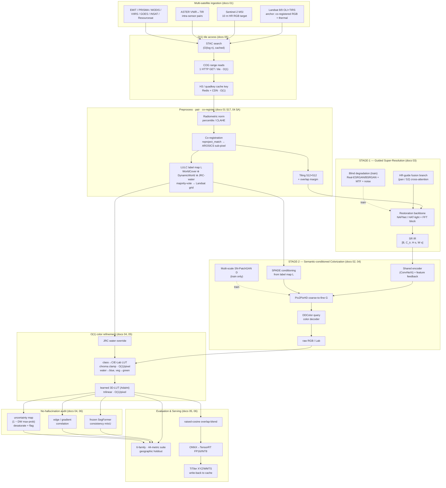

# irchroma — Infrared → RGB Super-Resolution & Colorization

**Bharatiya Antariksh Hackathon 2026 · Problem Statement 10**
*Infrared image colorization and enhancement for improved object interpretation.*

> **irchroma** is an end-to-end, Python framework that takes a single-channel **infrared (IR) satellite tile** and produces a **high-resolution, realistically colorized RGB** image — super-resolving faint IR structure **and** translating IR→RGB (forest→green, water→blue) while **preserving semantic integrity (no hallucinations)**, boosting downstream detection/segmentation, and serving tiles fast. It is **fidelity-dominant** (pixel-anchored to ground truth, generative terms bounded), **multi-source** (Landsat 8/9 anchor + ASTER/Sentinel-2/EMIT/INSAT fusion), **semantically-constrained** (land-cover SPADE conditioning + an O(1) class→color LUT + a frozen-segmenter consistency audit), and **O(1)-per-tile** on the serving hot path (COG range reads, H3/quadkey caching, learned 3D-LUT, ONNX→TensorRT, raised-cosine tiled inference).

---

## Architecture at a glance



Full design rationale: **[ARCHITECTURE.md](ARCHITECTURE.md)**. Research basis: **[docs/research/](docs/research/)** (six deep-dive reports on datasets, colorization, super-resolution, semantic guidance, fast platform, and evaluation).

---

## Key features

- **Two-stage, modular pipeline** with a shared restoration backbone — debuggable, swappable, separately budgetable (SR graded by PSNR/SSIM, color by FID).
- **Guided cross-sensor super-resolution** (NAFNet / HAT-light + an HR-guide fusion branch + blind degradation modeling) — recovers *real* structure instead of hallucinating it.
- **Semantically-faithful IR→RGB colorization** — paired conditional GAN: Pix2PixHD generator + **SPADE** land-cover conditioning + **DDColor** query color decoder + multi-scale spectral-norm PatchGAN. **BBDM diffusion** backup for a quality ceiling.
- **No-hallucination by design** — five layered guarantees: paired supervision, structure anchoring, semantic + **O(1) class→Lab color-LUT** constraints (water→blue, veg→green), a **frozen-segmenter consistency audit**, and **uncertainty maps** that desaturate + flag rather than fabricate.
- **Fidelity-dominant loss stack** — L1/Charbonnier + MS-SSIM + edge/gradient + FFT + feature-matching dominate; adversarial/colorfulness terms are bounded.
- **O(1)-per-tile serving** — COG range reads, H3/quadkey cache keys, learned 3D-LUT color, ONNX→TensorRT FP16/INT8, raised-cosine overlap-blend tiling, TiTiler XYZ/WMTS.
- **Rigorous evaluation** — a **6-family, 44-metric** suite under a **geographic-holdout** protocol with Blau–Michaeli distortion–perception–semantic triangulation and statistical significance testing.
- **Stable contract for parallel development** — [`config.py`](src/irchroma/config.py) (data contract) and [`interfaces.py`](src/irchroma/interfaces.py) (code contract) import with **stdlib only** (torch/omegaconf guarded), so all builders can code against them immediately.

---

## Repository layout

```
bah2026-ps10/
├── ARCHITECTURE.md              # the authoritative design document (start here)
├── README.md                    # this file
├── pyproject.toml               # project + optional extras [gee][serve][trt][detect][energy][dev]
├── requirements.txt             # core runnable deps
├── requirements-dev.txt         # dev tooling
├── Makefile                     # install / demo / train / eval / test / lint / format / serve
├── configs/
│   └── default.yaml             # YAML mirror of the Config defaults
├── docs/research/               # six deep-research reports (01-datasets … 06-evaluation-metrics)
└── src/irchroma/
    ├── config.py                # CONFIG CONTRACT (typed dataclasses + LULC taxonomy/palettes)
    ├── interfaces.py            # CODE CONTRACT (tensor conventions, Sample/PipelineOutput, base classes)
    ├── data/                    # multi-satellite ingestion, pairing, co-registration, LULC, datasets
    ├── models/{sr,colorization,semantic}/   # Stage-1 SR · Stage-2 color · semantic+LUT
    ├── losses/                  # the fidelity-dominant composite loss
    ├── metrics/                 # the 6-family / 44-metric evaluation suite
    ├── train/  infer/  serve/   # training · fast tiled inference · TiTiler serving
```

---

## Quickstart

### 1. Install

```bash
# Core framework (CPU-runnable; heavy providers are optional extras):
pip install -e .                     # or: make install

# With dev tooling (pytest / ruff / black / mypy):
pip install -e ".[dev]"              # or: make install-dev

# Optional provider extras, install as needed:
#   [gee]    Earth Engine + Planetary Computer access (data pairing/export)
#   [serve]  FastAPI + TiTiler + Redis tile server
#   [trt]    ONNX + TensorRT optimized inference (+ fvcore FLOPs)
#   [detect] Ultralytics YOLO-OBB + pycocotools (downstream detection eval)
pip install -e ".[gee,serve,trt,detect]"
```

> **Contract works before the heavy install.** `src/irchroma/config.py` and `src/irchroma/interfaces.py` import with **only the standard library** (plus *guarded* torch/omegaconf). Verify any time with:
> ```bash
> make smoke
> # -> OK contract import; TORCH_AVAILABLE = <bool>
> ```

### 2. Run the synthetic-data demo (no network / no credentials / no GPU)

```bash
make demo
# runs irchroma.train.cli --demo --config configs/default.yaml
# generates procedural IR↔RGB pairs and runs the full pipeline end-to-end on CPU.
```

The demo uses `irchroma.config.synthetic_demo_config()` — a tiny, CPU-only configuration — so the whole SR→colorize→LUT→audit path executes without any satellite data or accounts. This is also the integration smoke test for every builder's module.

### 3. Train

```bash
# Default (Landsat-anchored) config:
make train                                   # irchroma.train.cli --config configs/default.yaml

# Custom config (copy + edit configs/default.yaml):
make train CONFIG=configs/my_run.yaml
```

Configuration is a single typed `Config` object (see [`config.py`](src/irchroma/config.py)); `configs/default.yaml` mirrors its defaults and is regenerated with `make config-dump`. Training follows the two-stage recipe (Stage-1 SR warmup → joint colorization) with AMP/fp16, EMA, and geographic-holdout-aware validation.

### 4. Evaluate

```bash
make eval                                    # 6-family / 44-metric suite on a run's outputs
```

Emits the full scorecard — distortion (PSNR/SSIM/Y-PSNR/SAM/…), perceptual (clean-FID/CLIP-FID/KID/LPIPS/DISTS), no-reference IQA (NIQE/MUSIQ/…), color (ΔE2000/colorfulness/chroma-PSNR), faithfulness (seg-consistency mIoU/edge IoU/uncertainty/cycle-IR), downstream uplift (mAP/mIoU + bootstrap CI + Wilcoxon), and efficiency (latency/throughput/FLOPs/VRAM) — under the geographic-holdout protocol.

### 5. Serve (optional, needs `[serve]`)

```bash
make serve                                   # FastAPI/TiTiler XYZ/WMTS tile server
```

Serves colorized super-resolved tiles via XYZ/WMTS with COG range reads, H3/quadkey-keyed Redis/CDN caching, and write-back so repeat tiles are O(1) cache hits.

### Other Makefile targets

```bash
make test          # pytest
make lint          # ruff
make format        # black + ruff --fix
make typecheck     # mypy
make config-dump   # regenerate configs/default.yaml from the dataclasses
make help          # list all targets
```

---

## Minimal API sketch

The whole framework conforms to the contract in [`interfaces.py`](src/irchroma/interfaces.py):

```python
import sys; sys.path.insert(0, "src")
from irchroma.config import Config, synthetic_demo_config, LULC_CLASSES
from irchroma.interfaces import Sample, PipelineOutput  # TypedDicts (tensor conventions)

cfg = Config.from_yaml("configs/default.yaml")   # or: synthetic_demo_config()

# A Sample flows in; a PipelineOutput flows out (see interfaces.py for shapes):
#   Sample        : ir [B,C_ir,H,W], rgb? , guide?, semantic? [B,H,W], meta
#   PipelineOutput: rgb [B,3,H·s,W·s] in [0,1], sr, semantic_pred?, uncertainty?, aux
#
# pipeline = build_pipeline(cfg)          # irchroma.models.IRChromaPipeline (PipelineProtocol)
# out: PipelineOutput = pipeline.forward(batch)   # IR -> (SR, colorized RGB, uncertainty)

print(f"{len(LULC_CLASSES)} LULC classes:", LULC_CLASSES)
```

---

## Data sources

Landsat 8/9 OLI+TIRS is the **anchor** (the only single platform with co-registered RGB *and* thermal), fused with ASTER (intra-sensor pairs), Sentinel-2 (10 m RGB SR target), EMIT/PRISMA (spectrally-exact self-pairs), MODIS/VIIRS/GOES (volume + night), and ISRO **INSAT-3D / Resourcesat LISS-IV** for the Indian domain. Access is via **STAC + COG range reads** (Planetary Computer / AWS Open Data) and **Google Earth Engine** for server-side pairing/export. Full catalog, GEE/STAC IDs, and pairing/co-registration recipes: [docs/research/01-datasets.md](docs/research/01-datasets.md).

---

## Documentation & rationale

| Document | What it covers |
|---|---|
| **[ARCHITECTURE.md](ARCHITECTURE.md)** | Full system design, dataflow, module contracts, loss design, roadmap |
| [docs/research/01-datasets.md](docs/research/01-datasets.md) | 31 multi-satellite sources, pairing & co-registration recipes, O(1) access |
| [docs/research/02-colorization-models.md](docs/research/02-colorization-models.md) | 24 colorization methods; Pix2PixHD+DDColor primary, BBDM backup |
| [docs/research/03-super-resolution.md](docs/research/03-super-resolution.md) | 29 SR methods; guided cross-sensor SR primary |
| [docs/research/04-semantic-guidance.md](docs/research/04-semantic-guidance.md) | LULC data, SPADE, O(1) color-LUT, segmentation-consistency |
| [docs/research/05-fast-platform-o1.md](docs/research/05-fast-platform-o1.md) | 38 O(1)/fast techniques; honest complexity; latency budget |
| [docs/research/06-evaluation-metrics.md](docs/research/06-evaluation-metrics.md) | 44 metrics; geographic-holdout protocol; goalposts |

---

## License

MIT (see `pyproject.toml`). Satellite data are subject to their providers' terms (USGS public domain for Landsat; Copernicus for Sentinel; ISRO/NRSC for Indian sources).
